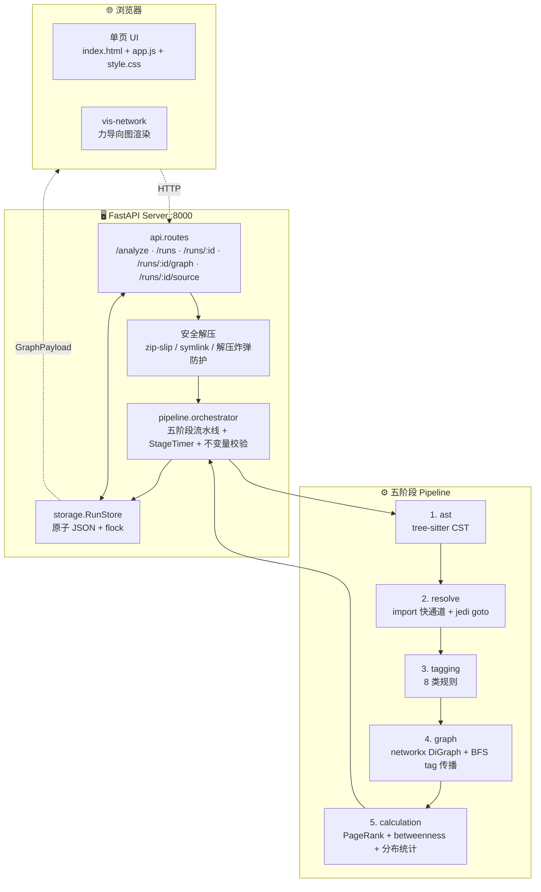

# pyknp · 代码知识图谱

> 代码知识图谱（Code Knowledge Graph）开源实现：把代码库自动转化为**函数级调用图 + 资源依赖标签**的可视化图谱。
> 前端风格参考 [GitNexus](https://github.com/abhigyanpatwari/GitNexus)，解析层基于 tree-sitter。
> 当前已支持 Python，多语言扩展中；实习项目脱壳而来的 MVP，后续持续优化、复现。

---

## 1. 这是什么

代码知识图谱（Code Knowledge Graph）把代码库抽象为图结构：**节点是函数，边是调用关系，节点属性携带资源依赖标签**（数据库 / 文件系统 / 网络 / 子进程 / HTTP 入口 / 测试 fixture 等）。这种结构化表达既服务于人类可视化理解陌生代码库，也是 GraphRAG、Coding Agent、影响分析、代码问答等下游 LLM 应用的基础设施。

本项目是一个端到端的开源实现，**当前已支持 Python 语言**，架构基于 tree-sitter（200+ 语言 grammar），后续将逐步扩展到 JavaScript / Go / Java 等语言。给定任意 Python 项目压缩包（`.zip` / `.tar.gz`），系统自动完成五件事：

1. **AST 解析** — 提取所有函数、方法、嵌套函数、装饰器、参数和模块 import 表
2. **跨文件调用解析** — 构建函数级调用图（Call Graph），每条边标注解析路径
3. **资源标签标注** — 8 类规则识别每个函数的资源角色（network / filesystem / database / subprocess / compute_heavy / http_endpoint / fixture / property）
4. **标签反向传播** — 如果 callee 访问数据库，所有 transitive caller 自动标记为「间接依赖数据库」
5. **中心性计算** — PageRank、betweenness、入/出度 Top-N，识别热点函数

最终产物是一张可交互的力导向图：节点颜色映射资源角色，节点尺寸映射重要性，点击任意节点可查看调用链流程图和源码片段。**前端可视化风格参考 [GitNexus](https://github.com/abhigyanpatwari/GitNexus)**——暗色三栏布局、力导向主图、节点类型着色、调用链联动、源码预览的整体观感受其启发。同时所有结构化数据通过 RESTful API 对外输出，供下游 Agent / RAG 系统消费。

### 解决什么问题

| 场景 | 代码知识图谱的回应 |
|---|---|
| 接手陌生代码库，想快速摸清整体结构 | 一张图看完全貌，按文件 / 类型筛选 |
| 评估底层函数变更的影响范围 | 反向 tag 传播已自动算好，点节点看所有 transitive caller |
| 为 Coding Agent 提供 GraphRAG 检索基础 | 调 `/api/runs/:id/graph` 拿结构化 GraphPayload JSON |
| 教学演示调用图 / 图算法 | 实时可视化 + 调用链 + 中心性排行 |

### 设计参考

- **前端可视化风格**：参考 [abhigyanpatwari/GitNexus](https://github.com/abhigyanpatwari/GitNexus) 的暗色三栏布局、力导向图交互、节点类型着色和调用链展示思路
- **解析技术栈**：基于 [tree-sitter](https://tree-sitter.github.io/)（200+ 语言 grammar）保证多语言扩展时的 API 一致性

---

## 2. 主要功能

- **项目上传**：浏览器拖拽 zip / tar.gz / tar，自动解压并识别项目根目录
- **AST 解析**：tree-sitter 解析所有 `.py` 文件，提取函数 / 方法 / 嵌套函数 / 装饰器 / 参数
- **跨文件调用解析**：import 快通道 + jedi goto 组合，构建函数级调用图
- **资源标签标注**：8 类规则识别每个函数的资源角色（network / filesystem / database / subprocess / compute_heavy / http_endpoint / fixture / property）
- **图构建与标签传播**：networkx DiGraph + 反向 BFS，把 callee 的 tag 传播到所有 transitive caller
- **中心性计算**：PageRank、betweenness、入/出度 Top-N
- **可视化交互**：力导向图、文件树过滤、节点类型筛选、深度聚焦、调用链流程图、源码片段预览
- **RESTful API**：5 个端点供下游 Agent / GraphRAG 系统调用

---

## 3. 技术栈

| 层 | 技术 |
|---|---|
| 运行时 | Python 3.12.13 + uv |
| AST 解析 | tree-sitter + tree-sitter-python |
| 语义解析 | jedi |
| 图算法 | networkx + numpy + scipy |
| 后端 | FastAPI + uvicorn |
| 数据契约 | Pydantic v2 |
| 持久化 | 文件系统 JSON（原子写 + flock） |
| 前端 | 原生 HTML + JavaScript + vis-network |
| 测试 | pytest + pytest-cov + pytest-regressions |
| 质量 | ruff + mypy --strict |

---

## 4. 架构总览



---

## 5. 工作原理：五阶段 pipeline

| 阶段 | 输入 | 输出 | 关键技术 |
|---|---|---|---|
| **① ast** | `.py` 文件树 | `FunctionNode[]` + `ImportTable` | tree-sitter CST + 树遍历 |
| **② resolve** | functions + imports | `CallEdge[]` | import 快通道 + jedi goto 兜底；O(E) 复杂度 |
| **③ tagging** | functions + imports | `direct_tags: {loc: [TagEvidence]}` | 8 类规则，注册式 |
| **④ graph** | location_ids + edges + direct_tags | `propagated_tags` | networkx DiGraph + 反向 BFS |
| **⑤ calculation** | propagated + pagerank + betweenness | `CalculationReport` | networkx + 分布统计 |

### 数据流

```mermaid
flowchart LR
    PY[".py 文件树"] --> S1["① ast"]
    S1 -->|FunctionNode[]<br/>ImportTable[]| S2["② resolve"]
    S2 -->|CallEdge[]<br/>location_id 回填| S3["③ tagging"]
    S1 -.functions+imports.-> S3
    S3 -->|direct_tags| S4["④ graph"]
    S2 -.edges.-> S4
    S4 -->|propagated_tags| S5["⑤ calculation"]
    S5 -->|CalculationReport<br/>pagerank/分布/Top-N| OUT["PipelineRunResult"]
```

### Tag 体系（8 类）

| Tag | 触发条件 |
|---|---|
| `network` | import / 调用 `requests` `httpx` `socket` `urllib` |
| `filesystem` | `pathlib` `os.path` `shutil` 或裸 `open()` |
| `database` | `sqlite3` `sqlalchemy` `psycopg2` `asyncpg` |
| `subprocess` | `subprocess.run` `os.system` `os.popen` |
| `compute_heavy` | `numpy` `pandas` `scipy` `tensorflow` `torch` |
| `http_endpoint` | `@app.route` `@app.get` `@router.post` + Web 框架导入 |
| `fixture` | `@pytest.fixture` + pytest 导入 |
| `property` | `@property` 装饰器 |

### 运行时不变量

pipeline 跑完后强制校验 4 项不变量，违反则 status=FAILED：

1. 每个 `FunctionNode` 在 resolve 完成后必有 `location_id`
2. 每条 `CallEdge.caller_location_id` 必须能在 `FunctionNode` 列表里查到
3. `propagated_tags ⊇ direct_tags`（传播只增不减）
4. `tag_distribution` 各 tag 计数 = 该 tag 在 `propagated_tags` 中出现的 function 数

---

## 6. 目录结构

```
label-analysis/
├── src/pyknp/                          # 源码主包
│   ├── __init__.py
│   ├── app.py                          # FastAPI 应用工厂（装配 router + static + state）
│   │
│   ├── api/                            # HTTP 接口层
│   │   ├── __init__.py
│   │   └── routes.py                   # 5 个端点 + 安全解压 + GraphPayload 派生
│   │
│   ├── model/                          # Pydantic 数据契约
│   │   ├── __init__.py
│   │   ├── function.py                 # FunctionNode：ref_id / location_id / params / decorators
│   │   ├── edge.py                     # CallEdge：caller → callee + resolved_via
│   │   ├── tag_evidence.py             # TagEvidence：tag + reason + snippet
│   │   ├── tag.py                      # Tag 枚举（8 类）
│   │   ├── run.py                      # PipelineRunResult + CalculationReport + RunSummary
│   │   └── graph_payload.py            # GraphPayload / GraphNode / GraphEdge（前端友好）
│   │
│   ├── pipeline/                       # 五阶段流水线
│   │   ├── __init__.py
│   │   ├── orchestrator.py             # 串联 5 阶段 + StageTimer + 不变量校验
│   │   ├── ast/
│   │   │   ├── __init__.py             # re-export run()
│   │   │   └── ast.py                  # tree-sitter CST 解析 + 函数节点遍历
│   │   ├── resolve/
│   │   │   ├── __init__.py
│   │   │   └── resolve.py             # import 快通道 + jedi goto
│   │   ├── tagging/
│   │   │   ├── __init__.py
│   │   │   └── tagging.py             # 8 类规则注册与执行
│   │   ├── graph/
│   │   │   ├── __init__.py
│   │   │   └── graph.py               # networkx DiGraph + tag 反向 BFS 传播
│   │   └── calculation/
│   │       ├── __init__.py
│   │       └── calculation.py          # tag 分布 / Top-N / 模块聚合
│   │
│   ├── rules/                          # tagging 规则实现（每条独立可测）
│   │   ├── __init__.py                 # 注册所有规则到 registry
│   │   ├── base.py                     # 规则基类 + 注册机制
│   │   ├── network.py                  # network 资源
│   │   ├── filesystem.py               # filesystem 资源
│   │   ├── database.py                 # database 资源
│   │   ├── subprocess_rule.py          # subprocess 资源
│   │   ├── compute_heavy.py            # compute_heavy 资源
│   │   ├── http_endpoint.py            # @app.route 等装饰器
│   │   ├── fixture.py                  # @pytest.fixture
│   │   └── property_rule.py            # @property
│   │
│   ├── storage/                        # 持久化层
│   │   ├── __init__.py
│   │   └── run_store.py                # 原子 JSON + fcntl.flock + index.json
│   │
│   └── frontend/                       # 前端单页应用
│       ├── index.html                  # 入口 HTML（三栏布局）
│       ├── app.js                      # 主逻辑（上传 / 渲染 / 详情 / 调用链）
│       ├── style.css                   # 暗色主题样式
│       └── vis-network.min.js          # 本地托管的 vis-network 库
│
├── tests/                              # 测试套件
│   ├── __init__.py
│   ├── conftest.py                     # pytest 公共 fixture
│   ├── unit/                           # 单元测试（每阶段独立）
│   │   ├── test_ast.py                 # AST 阶段
│   │   ├── test_ast_edge_cases.py      # AST 边界场景
│   │   ├── test_resolve.py             # resolve 阶段
│   │   ├── test_tagging.py             # tagging 阶段
│   │   ├── test_graph.py               # graph 阶段
│   │   ├── test_calculation.py         # calculation 阶段
│   │   ├── test_orchestrator.py        # orchestrator 编排
│   │   ├── test_models.py              # Pydantic 模型
│   │   ├── test_tag.py                 # Tag 枚举
│   │   └── test_coverage_gaps.py       # DoS / 超时 / 不变量等边界覆盖
│   ├── integration/                    # 阶段间集成测试
│   │   └── test_pipeline_integration.py
│   ├── api/                            # FastAPI 路由契约测试
│   │   └── test_routes.py
│   ├── storage/                        # 持久化并发测试
│   │   └── test_run_store.py
│   ├── rules/                          # 8 类 tag 规则测试
│   │   ├── test_registry.py
│   │   ├── test_network.py
│   │   ├── test_http_endpoint.py
│   │   ├── test_fixture.py
│   │   └── test_property_rule.py
│   ├── e2e/                            # E2E + golden 快照回归
│   │   └── test_pipeline_e2e.py
│   └── fixtures/sample_project/        # 8 文件小项目，覆盖全部 tag
│       ├── pyproject.toml
│       └── sample/
│           ├── __init__.py
│           ├── main.py                 # 程序入口
│           ├── web_api.py              # 触发 http_endpoint
│           ├── db_utils.py             # 触发 database
│           ├── fs_utils.py             # 触发 filesystem
│           ├── net_utils.py            # 触发 network
│           ├── proc_utils.py           # 触发 subprocess
│           ├── math_utils.py           # 触发 compute_heavy
│           ├── models.py               # 数据模型
│           ├── re_export.py            # re-export 场景
│           └── test_something.py       # 触发 fixture
│
├── data/                               # 运行产物（被 .gitignore）
│   ├── runs/                           # 每个 run 一个 JSON
│   ├── uploads/                        # 解压后的项目源码
│   └── index.json                      # run 列表索引
│
├── .python-version                     # Python 版本锁定（3.12.13）
├── Makefile                            # setup/test/lint/run/clean 统一入口
├── pyproject.toml                      # uv + hatchling + ruff + mypy strict
├── uv.lock                             # 依赖锁定文件
├── README.md
└── .gitignore
```

---

## 7. 快速开始

### 7.1 环境准备

需要本地已安装：

- **Python 3.12.13**（项目锁死小版本，避免 3.13/3.14 的 tree-sitter 兼容坑）
- **uv**（Python 包管理器，替代 pip / poetry）

如果还没装 uv：

```bash
# macOS
brew install uv

# 其他平台
curl -LsSf https://astral.sh/uv/install.sh | sh
```

### 7.2 初始化项目

```bash
# 1. 克隆代码
git clone <repo-url>
cd label-analysis

# 2. 安装依赖（uv 会自动创建 .venv 并按 uv.lock 锁定版本）
make setup
# 等价于：uv sync

# 3. 准备运行目录（data/runs + data/uploads，已在 .gitignore）
# 首次启动时 FastAPI 会自动创建，无需手动 mkdir
```

### 7.3 启动服务

```bash
# 开发模式（带热重载，仅监听 src/ 变更）
make run
# 等价于：uv run uvicorn pyknp.app:app --reload --reload-dir src --port 8000

# 或生产模式（无热重载，可加 workers）
uv run uvicorn pyknp.app:app --port 8000 --workers 4
```

### 7.4 使用

1. 浏览器打开 `http://localhost:8000/`
2. 顶栏拖入任意 Python 项目压缩包（`.zip` / `.tar.gz` / `.tar`）
3. 点击 **Analyze** 按钮，等待几秒到几十秒（取决于项目规模）
4. 图加载完成后：
   - 拖拽节点 / 滚轮缩放 / Shift 多选
   - 工具栏筛选节点类型 / 边类型 / 聚焦深度
   - 左侧 Files 列表点击文件可过滤
   - 点击节点看右侧详情（调用链流程图 + 源码片段）
   - 左侧 Top PageRank 排行可点击跳转热点函数

**试试看：** 把 `httpx` 或 `flask` 源码打包成 zip 上传，搜索 `@app.route` / `@app.get` 装饰的节点（青色），看其调用链。

---

## 8. 测试

### 8.1 测试组织

| 目录 | 类型 | 说明 |
|---|---|---|
| `tests/unit/` | 单元 | 每个阶段独立测试，覆盖所有 if/else 分支 |
| `tests/integration/` | 集成 | 阶段间数据传递（ast → resolve → graph 等） |
| `tests/api/` | API | FastAPI 路由契约（上传 / 查询 / 源码） |
| `tests/storage/` | 存储 | 持久化原子写 / 多进程并发 |
| `tests/rules/` | 规则 | 8 类 tag 规则独立验证 |
| `tests/e2e/` | E2E | 8 文件样例项目跑完整 pipeline，golden 快照回归 |

样例项目 `tests/fixtures/sample_project/` 故意覆盖全部 8 类 tag，确保 E2E 测试能验证所有规则路径。

### 8.2 常用命令

```bash
make help              # 列出所有 target

# 测试
make test              # 单元 + 集成 + API + storage + rules（默认不带 E2E）
make test-unit         # 仅单元测试
make test-integration  # 仅集成 + API + storage + rules
make test-e2e          # E2E + golden 快照回归
make test-all          # 全量（含 E2E）
make test-coverage     # 全量 + 100% line/branch 覆盖率门槛

# Golden 快照
make golden-update     # 修改了预期输出后刷新 E2E 快照
```

### 8.3 质量门槛

| 指标 | 门槛 | 当前 |
|---|---|---|
| 测试通过率 | 100% | ✅ 136/136 |
| Line coverage | 100% | ✅ |
| Branch coverage | 100% | ✅ |
| ruff | 0 告警 | ✅ |
| mypy --strict | 0 错误 | ✅ |

`make test-coverage` 用 `--cov-fail-under=100` 强制覆盖率门槛，未达标直接 fail。

---

## 9. 开发命令

```bash
# 代码质量
make lint              # ruff 静态检查
make format            # ruff 自动格式化
make typecheck         # mypy --strict

# 维护
make clean             # 清理 .venv / 缓存 / data 产物
```

### 典型开发循环

```bash
# TDD：先写测试，看红 → 实现 → 看绿 → 重构
make test-unit         # 跑相关单元测试

# 提交前完整检查
make lint typecheck test-coverage
```

---

## 10. API 一览

| 方法 | 路径 | 说明 |
|---|---|---|
| `POST` | `/api/analyze?project_name=xxx` | multipart 上传 zip/tar.gz，同步跑 pipeline；返回最小响应 `{run_id, status, project_name, total_functions, total_edges, errors}` |
| `GET` | `/api/runs` | 列出所有 run 摘要 |
| `GET` | `/api/runs/{run_id}` | 完整 `PipelineRunResult`（functions + edges + propagated_tags + calculation） |
| `GET` | `/api/runs/{run_id}/graph` | 前端友好的 `GraphPayload`（nodes + edges + tag_distribution） |
| `GET` | `/api/runs/{run_id}/source?file=...&start_line=...&end_line=...` | 源码片段，前端代码预览面板用 |

服务启动后访问 `http://localhost:8000/docs` 可看自动生成的 OpenAPI 交互文档。

**限制：** 上传 ≤500MB；pipeline 同步执行超时 900s（HTTP 408）；解压总字节 ≤2GB、成员数 ≤100k。

---

## 11. 后续扩展方向

> 当前版本是 MVP，目标是跑通"上传 → 解析 → 图谱 → 可视化"主流程。
> 后续慢慢优化，因为这是实习真实项目，并且实习中它做得不是很好，并不支持增量分析内容。

- **多语言支持** — tree-sitter 已铺路（grammar 现成），加 JS / Go / Java 解析
- **GraphRAG 集成** — 把图谱喂给 LLM 做代码问答
- **异步 pipeline** — Celery / RQ + WebSocket 进度推送（当前同步阻塞单 worker）
- **GitHub URL 直传** — 省掉手动 zip + 上传，直接 clone
- **规则外置** — YAML 仓库 + `target_projects` / `scope` 字段，业务方自助加规则
- **人工标注 + 评估** — Recall / Precision / F1，量化 tagging 规则准确率
- **社区发现聚类** — Louvain / Leiden 算法，按模块/团队自动分块
- **增量分析** — 同一项目变更后只重跑受影响子图（git diff → 子树 invalidate）

---

## License

MIT — 课设作品，可自由参考。
